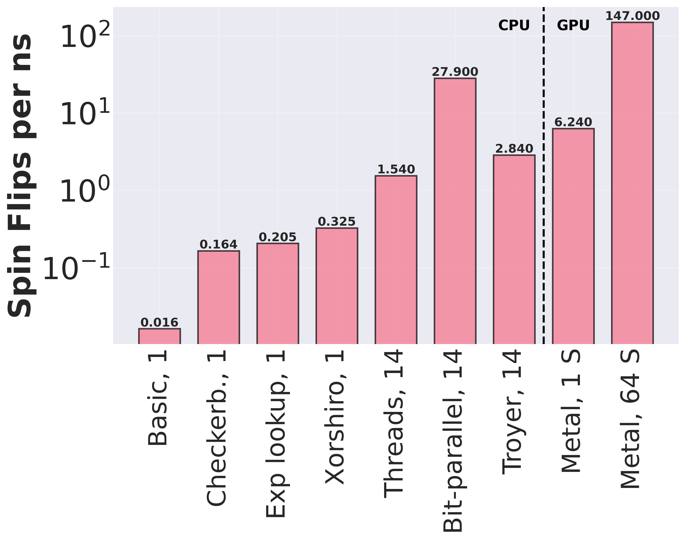

# High-Performance 2D Ising Model Simulation on CPU

## Overview

This repository contains a highly optimized C++ implementation of a 2D Ising model simulation, demonstrating progressive performance improvements from a basic implementation to a highly parallelized version capable of achieving up to 1 billion spin-flips per second on a laptop.

## Background

The Ising model is a fundamental mathematical model in statistical mechanics used to study magnetic phase transitions and collective behavior in materials. This project explores various optimization techniques to dramatically improve the computational performance of Ising model simulations.

## Performance Progression

The optimization journey includes several key stages:

1. **Basic Implementation**: Serial Monte Carlo Metropolis sampling
2. **Checkerboard Updates**: Parallel spin updates using a checkerboard pattern
3. **Exponential Lookup**: Pre-computing exponential values
4. **Xorshiro Random Number Generator**: Faster random number generation
5. **Multithreading**: Utilizing multiple CPU cores
6. **Multi-spin Updates**: Parallel 64-spin simulation using bitwise operations
7. **Troyer**: Running code from Isakov et al. (https://doi.org/10.48550/arXiv.1401.1084)
8. **Apple Metal**: Utilizing graphics processing capabilities.
9. **Apple Metal Multi-spin**: Utilizing graphics processing capabilities with Multi-spin updates.

### Performance Metrics

- Baseline: Initial implementation
- Checkerboard Updates: ~10x speedup
- Exponential Lookup: ~12x speedup
- Xorshiro RNG: ~20x speedup
- Multithreading: ~90x speedup
- Multi-spin Updates: ~1700x speedup
- Troyer Updates: ~175 speedup
- Apple Metal: ~385 speedup
- Apple Metal, Multi-spin: ~9070 speedup

### Plot

